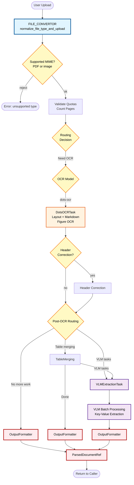
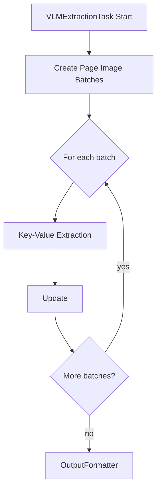
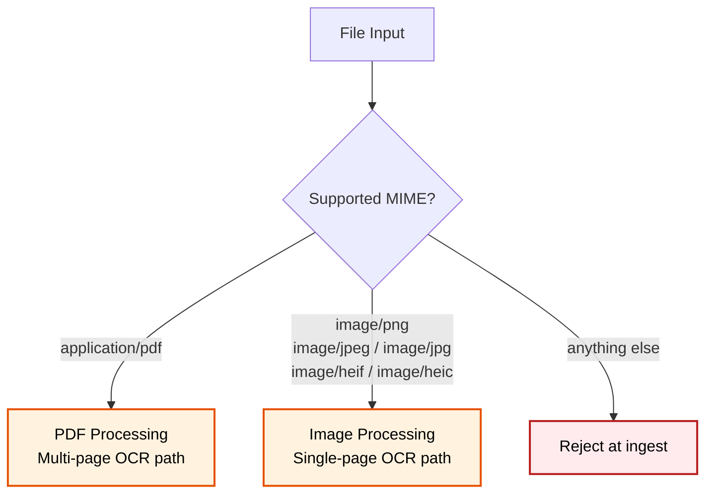

# Open Ingest Pipeline

This document is a visual reference for the current ingestion DAG. The pipeline
flows: **upload -> file validation -> OCR / layout -> optional retained enrichment ->
assembled output**. Each stage is a `@function`/`@cls` task; we run them
ourselves via the `--local` runner (see [`CLAUDE.md`](../CLAUDE.md)).

The service accepts PDF and image inputs only. Structured extraction is out of
scope for this repo; Rails owns that layer.

## Complete Flow

## Retained VLM Enrichment

## File Type Processing

