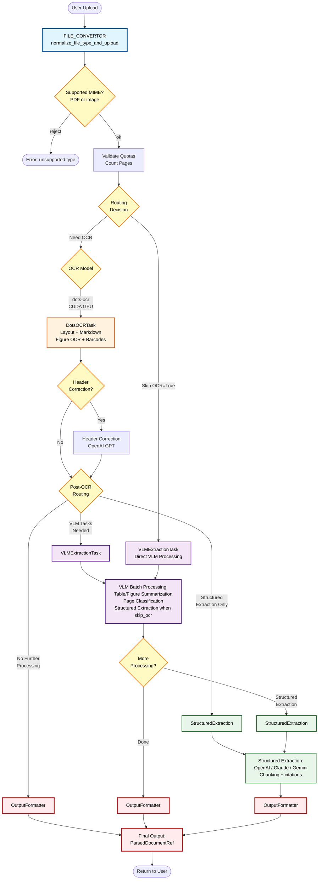
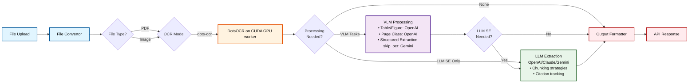
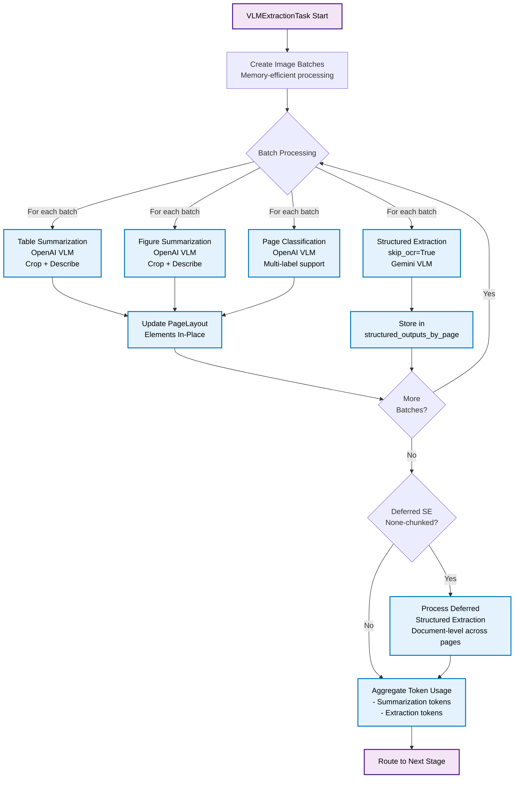
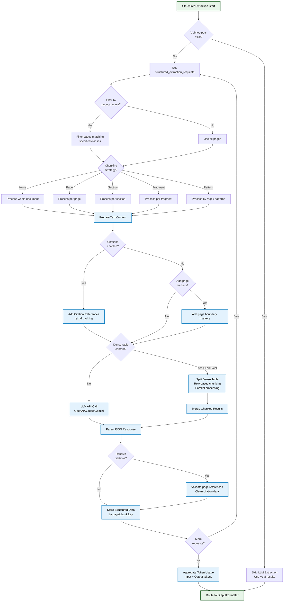
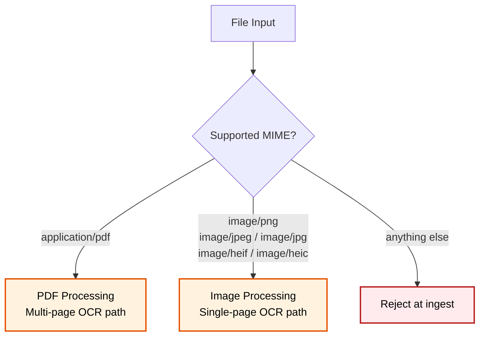

# Open Ingest Pipeline - Mermaid Flowchart

This document is a visual reference for the end-to-end ingestion DAG. The pipeline
flows: **upload → file conversion → routing → OCR / layout → optional VLM enrichment
→ optional structured extraction → assembled output**. Each stage is a
`@function`/`@cls` task; we run them ourselves via the `--local` runner (see
[`CLAUDE.md`](../CLAUDE.md)).

The diagrams below show the full graph and per-branch detail; use them to find the
function that owns a given behavior before diving into `src/tensorlake_docai/`.

A few terms used in the diagrams:

- **`skip_ocr`** — a per-request flag on `StructuredExtractionRequest`. When
  `True`, the pipeline skips OCR entirely and feeds page images directly to a
  vision LLM (Gemini) for structured extraction. Useful for visually dense
  documents where OCR misses layout cues.
- **Chunking strategies** — `none` (whole doc), `page` (one chunk per page),
  `section` / `fragment` (layout-driven), or `patterns` (regex boundaries). Set
  per-extraction via `StructuredExtractionRequest.chunking_strategy`.

## How to View/Edit This Diagram

1. **GitHub/GitLab**: Paste this code in a .md file - it will render automatically
2. **VS Code**: Install "Markdown Preview Mermaid Support" extension
3. **Online Editor**: https://mermaid.live/ - paste and edit in real-time
4. **Notion**: Use `/code` block and select "Mermaid"
5. **Draw.io**: Import Mermaid code directly
6. **Obsidian**: Native Mermaid support

---

## Complete Pipeline Flowchart

---

## Simplified High-Level Flow

---

## VLM Extraction Task Detail

---

## Structured Extraction Task Detail

---

## OCR Model Comparison Table

| `ocr_model` | Provider | Speed | Layout | Tables | Figures | Forms | Special Features |
|-------------|----------|-------|--------|--------|---------|-------|------------------|
| `dots-ocr` | DotsOCR on CUDA GPU worker | Fast | ✓ | ✓ | ✓ | ✓ | Custom prompts, Barcodes, two-stage Ovis figure OCR |

---

## File Type Processing Matrix

